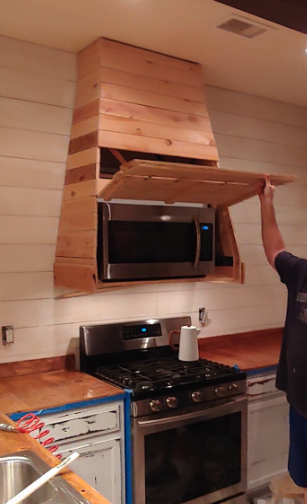
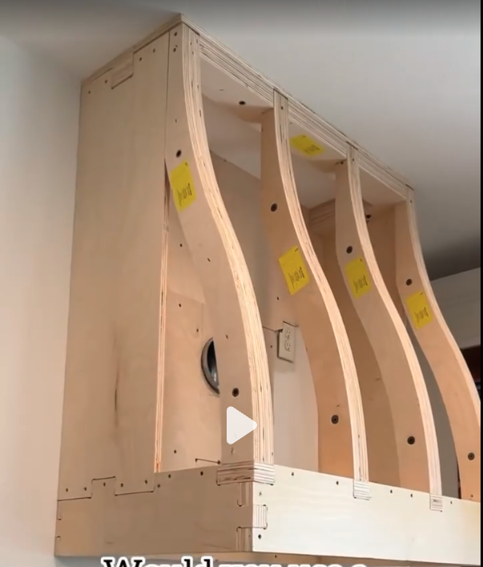

# Journal — April 10, 2026

## Kitchen Range Hood Build

Custom cedar range hood installed over the stove, concealing an over-the-range microwave behind a flip-up panel. The hood is built from horizontal cedar planks with a tapered profile that narrows toward the ceiling. The flip-up door on the front provides full access to the microwave controls and door while keeping the look clean when closed. Shiplap walls on either side. Stainless steel gas range below. Blue painter's tape still visible along the base — work in progress.

## Range Hood — Internal Frame

CNC-cut plywood frame for a curved range hood, mounted to the wall. Four S-curve ribs define the tapered profile, connected by flat plywood panels on the top and sides. Vent duct hole cut in the back panel. Yellow labels on each rib (likely part numbers or orientation marks from the CNC layout). The frame is the structural skeleton — ready to be clad with the cedar planks seen in the finished version above.

